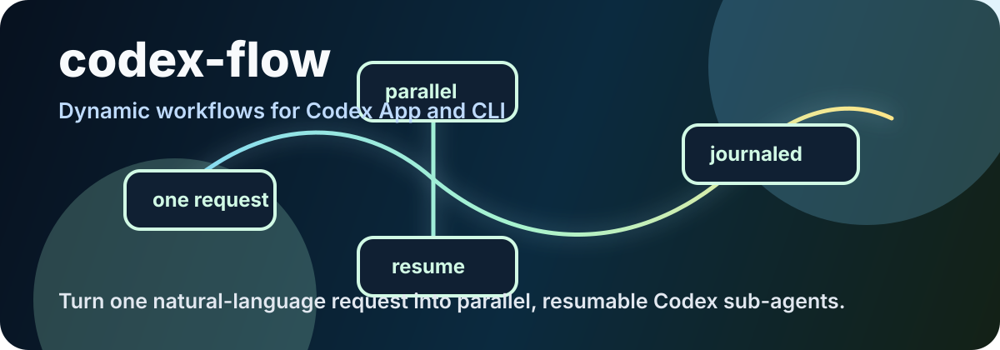
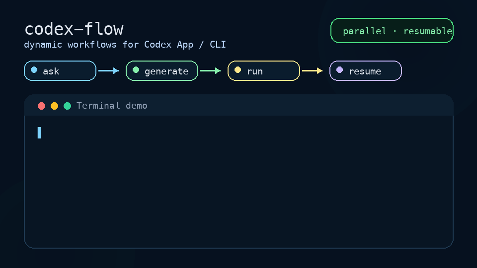

# codex-flow — dynamic workflows for Codex

[](https://github.com/Dmatut7/codex-flow/releases)
[](LICENSE)
[](package.json)
[](docs/CODEX_APP_CLI.md)



Turn one natural-language request in Codex App or Codex CLI into **parallel, resumable, journaled Codex sub-agents**.

Instead of asking Codex to do one long linear pass, say “use a dynamic workflow” and let Codex split the task, run branches in parallel, replay completed work after interruption, and summarize the journaled result.

Built for maintainers and power users who do repeated multi-file work:

- **Bug investigations** — one hypothesis or file group per Codex sub-agent.
- **PR / code review** — fan out review passes, then merge findings.
- **Issue triage** — classify, reproduce, and propose next actions in parallel.
- **Release smoke checks** — run repeatable checks with journaled evidence.

If this is useful, star the repo so more Codex users can find it: [Dmatut7/codex-flow](https://github.com/Dmatut7/codex-flow).

## What it feels like



The important difference is not another config file. It is the loop:

1. say a normal sentence in Codex,
2. Codex generates a temporary workflow,
3. `codex-flow` runs the branches,
4. the journal makes interruption and rerun cheap.

Prefer a static version? See the [storyboard SVG](assets/codex-flow-demo.svg).

## 30-second start

```bash
npm install -g github:Dmatut7/codex-flow  # installs the `codex-flow` CLI
codex-flow doctor                       # checks local install + fake backend
codex-flow try                          # creates + runs a starter workflow without network
codex-flow install-codex                # installs the "dynamic-workflow" skill into Codex
codex-flow doctor                       # confirms the Codex skill is installed
# restart Codex
```

After the npm package is published, the install command becomes `npm install -g codex-flow`.
`dongt` remains as a compatibility alias, but the public package and docs use `codex-flow`.

Then, in **any** project, just tell Codex:

> 用动态工作流帮我排查登录失败的问题
>
> use a dynamic workflow to investigate this bug across these files, in parallel

Codex (via the installed skill) will:

1. decide the task suits a dynamic workflow,
2. **generate** a temporary workflow under `.codex-flow/generated/`,
3. **run** it (`codex-flow run …`) — many Codex sub-agents in parallel,
4. **summarize** the result.

It uses **your Codex / ChatGPT membership login** — no OpenAI API key needed.

If the run is interrupted (Ctrl-C, crash, budget), running it again **resumes**: finished work replays instantly, only unfinished nodes call Codex again.

See [how to use it in Codex App / CLI](docs/CODEX_APP_CLI.md), the [FAQ](docs/FAQ.md), the [prompt gallery](docs/PROMPTS.md) for copy-paste Codex prompts, and the [maintainer workflow gallery](examples/README.md) for import-free runnable bug investigation, PR review, issue triage, and release smoke workflows. See [docs/POSITIONING.md](docs/POSITIONING.md) for what `codex-flow` is / is not, [ROADMAP.md](ROADMAP.md) for public next steps, and [docs/LAUNCH_PLAYBOOK.md](docs/LAUNCH_PLAYBOOK.md) for sharing / launch copy.

## Why this is more than "an engine"

A normal Codex turn is linear. `codex-flow` makes Codex orchestrate:

- **parallel fan-out** — one sub-agent per file / hypothesis / item, all at once,
- **content-addressed resume** — re-run = free replay of completed work,
- **journaling / audit** — every node + token usage recorded in `.codex-flow/journal/*.jsonl`,
- **soft token budget**, deterministic control flow, schema-validated outputs.

## Manual use (optional)

You can also run a workflow file directly:

```bash
codex-flow run path/to/my.workflow.ts                 # default backend: codex-sdk (your membership)
codex-flow run path/to/my.workflow.ts --backend fake  # no network, for testing
```

A workflow is a single file that exports a default function. The skill generates these for you, but here is the shape (import-free, plain JSON Schema):

```ts
export default async function workflow(ctx) {
  const { agent, parallel, phase, log } = ctx;
  const Schema = {
    type: "object", additionalProperties: false,
    required: ["file", "suspect", "confidence"],
    properties: { file: { type: "string" }, suspect: { type: "string" }, confidence: { type: "number" } },
  };
  const files = ["src/auth/login.ts", "src/auth/session.ts"];
  const findings = await phase("investigate", async () =>
    parallel(files.map((file) => async () =>
      (await agent(`Investigate ${file} for the login bug; report the suspect + 0..1 confidence.`,
        { schema: Schema, sandbox: "read-only" })).output))
  );
  log("findings", findings);
  return { findings: findings.filter((f) => f && f.confidence >= 0.5) };
}
```

Full API + rules: `codex-skill/references/engine-api.md`.

## Engine primitives

`ctx.agent(prompt, opts)` (one sub-task), `ctx.parallel(thunks)` (barrier fan-out), `ctx.pipeline(items, ...stages)` (per-item, no barrier between stages), `ctx.phase(title, body)`, `ctx.log(msg, data)`, `ctx.now()` / `ctx.random()` (deterministic), `ctx.budget`.

Key `agent` opts: `schema` (Zod or JSON Schema → strict JSON output), `sandbox` (`read-only` | `workspace-write` | `danger-full-access`), `cwd` (required for writable nodes), `backend`, `timeoutMs`, `retries`, `nodeKey`.

Use `ctx.now()` / `ctx.random()` for control flow — never wall-clock or ambient RNG to decide which nodes exist.

## Programmatic use (optional)

The project is CLI-first, but the package also exports the engine:

```js
import { createEngine } from "codex-flow";

const engine = createEngine({ defaultBackend: "fake", autoRoute: false });
const result = await engine.run(async ({ agent }) =>
  (await agent("hello", { backend: "fake" })).output
);
console.log(result);
```

## Backends and routing

- `codex-sdk` (default): in-process Codex SDK thread, uses your membership login.
- `codex-exec`: spawns `codex exec --json` for hard process isolation.
- `openai-responses`: direct Responses API with strict JSON — **needs `OPENAI_API_KEY`** (separate from a Codex membership). Optional cheap fast-path.
- `fake`: deterministic, no network — for tests.

Routing: `opts.backend` wins → else (if `autoRoute`) an explicitly `pure`/`kind` schema-only node may use `openai-responses`, an `isolate:true` node uses `codex-exec` → else `defaultBackend`. The engine never infers "pure" from a missing `cwd`.

## Config

Per-project overrides go in `.codex-flow/config.json`; the engine-level config (also used by `createEngine`) supports:

- `defaultBackend`, `autoRoute`, `concurrency`, `hardMaxConcurrency`, `providerRateBudget`
- `seed` (deterministic `now`/`random` + shadows), `defaultModel`, `estimatedTokensPerCall`, `timeoutMs`
- `transientRetries`, `transientBaseMs` (429/5xx/network retry, separate from schema repair)
- `budget.maxTokens` / `budget.maxNodes` / `budget.onExceeded` (`throw` | `skip` | `downgrade`)
- `adapters.codexSdk` (→ `new Codex`), `adapters.codexExec` (`codexPath`, `env`, `graceWindowMs`), `adapters.openaiResponses` (→ `new OpenAI`), `adapters.fake`

## Resume / replay

Automatic. Completed terminal nodes replay by `cacheKey` (prompt + validation schema + model + resolved cwd + sandbox + structural position + dependency `prevKey`). The key excludes backend identity, thread id, signal, timestamps, jitter, env, wall-clock, and repair text. Replayed nodes don't call the backend or charge budget. A torn trailing journal line is dropped; a node whose journal ends on a non-terminal repair record re-runs.

## Determinism boundary

During a run, the workflow gets seeded shadows for `Date`, `Date.now`, `Math.random`, `performance.now`, `process.hrtime`, and `crypto.randomUUID`/`getRandomValues`. Best-effort: deps that captured real globals at import time can still leak — keep control flow on `ctx.now()`/`ctx.random()`.

## Verify it on real Codex

```bash
codex-flow smoke --backend codex-sdk     # one real structured call
codex-flow smoke --backend codex-exec
```
Missing credentials prints `SMOKE_SKIPPED` and exits 0.

## Develop / test

```bash
npm run typecheck
npm test            # FakeAdapter only, no network
```

Regression suite covers keyed replay, dependency-subtree invalidation, schema repair, transient retry, writable-cwd protection, deterministic shadows + stable cache keys, soft-budget skip, crash-residue / non-terminal-repair journal recovery, backend routing, and the CLI (`install-codex` + `run`).

See [CONTRIBUTING.md](CONTRIBUTING.md) for local development rules and [docs/CODEX_FOR_OSS_APPLICATION.md](docs/CODEX_FOR_OSS_APPLICATION.md) for the Codex for Open Source application prep notes.
